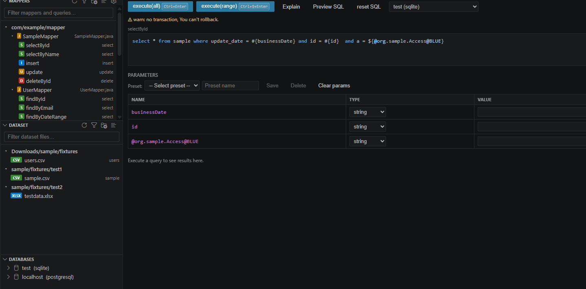

# MyBatis Utility



VSCode extension for MyBatis developers. Browse Mapper files, fill query parameters, and execute SQL against configured databases — all without leaving the editor.

## Features

- **Mapper panel** — Scans Java (`@Mapper`) and XML mapper files, lists every query by name and type. Supports inline SQL annotations (including Java 15+ **text blocks** `"""..."""`) and XML-mapped interfaces. Results stream in folder-by-folder so the panel populates progressively on large projects. Scan results are cached — switching to another panel and back reuses the result instantly without rescanning. MyBatis Generator `@SelectProvider` / `@InsertProvider` etc. are automatically skipped (no inline SQL to browse)
- **Query panel** — Click a query to open it, edit SQL inline with **syntax highlighting**, fill typed parameters (`#{param}`), and execute
- **Live SQL preview** — Click **Preview SQL** to see the final SQL with all parameters substituted inline, before executing
- **Explain plan** — Click **Explain** to run `EXPLAIN` on the current SQL and inspect the query plan
- **Dataset loader** — **Dataset** panel scans for CSV / XLSX fixture files in your workspace. Filter files in real time with the search input, switch between flat and hierarchical views, click any file to open the loader, preview data, map sheets to database tables, and bulk-load with one click (clears and reloads the target table). XLSX sheet names are read automatically when the loader opens
- **Parameter presets** — Save named sets of parameter values to `.vscode/mybatis-utility/params.yaml`. Load them from a dropdown to re-fill values instantly. The file can be committed and shared across the team
- **Multi-database support** — SQLite, PostgreSQL, MySQL (extensible driver registry)
- **Pagination** — Large result sets paginated (configurable page size)
- **CSV export** — Export query results to CSV with one click
- **Keyboard shortcuts** — `Ctrl+Enter` / `Ctrl+Shift+Enter` to execute without touching the mouse

## Requirements

- VSCode 1.85 or later
- For PostgreSQL / MySQL: a running database server (no extra drivers needed — pure JS)
- For SQLite: a `.db` / `.sqlite` file (WASM-based, no native compilation)

## Getting Started

### 1. Configure scan folders

Open Settings (`Ctrl+,`) and search for **MyBatis Utility**, or use the **`$(new-folder)`** and **`$(filter)`** buttons in the Mapper panel title bar to add include / exclude patterns interactively — the picker shows the actual directories found in your workspace so there is no need to type paths manually.

To set patterns directly in settings, set **Scan Folders** to the directories that contain your Mapper files:

```json
"mybatisUtility.scanFolders": [
  "src/main/java",
  "src/main/resources/mapper"
]
```

Default: `["**/mapper", "**/repository"]` — works for most Spring Boot / Maven projects out of the box.

To exclude specific directories from the scan (e.g. generated code), use **Scan Exclude**:

```json
"mybatisUtility.scanExclude": ["**/generated/**", "**/legacy/**"]
```

`node_modules`, `target`, `build`, `out`, `dist`, `.gradle`, `src/test`, `src/test-*` are always excluded.

> **Per-folder settings**: in a multi-root workspace each folder can have its own `scanFolders` and `scanExclude` configured in its `.vscode/settings.json`. All settings have `"scope": "resource"` so VSCode applies the correct value per folder automatically.

> **Maven multi-module projects**: open the root project folder in VSCode. The default `**/mapper` pattern finds mapper directories in every module automatically.

The **Mappers** panel in the sidebar will populate automatically. A **Scanning…** indicator is shown while the workspace is being searched. Results appear folder-by-folder as they are found. Use the filter input at the top to narrow results in real time, and use the list/tree icon in the title bar to switch between flat and hierarchical views.

### 2. Add a database connection

In the **Databases** panel, click **+** to add a connection via a quick wizard, or click the gear icon to open the full configuration panel.

Supported types:

| Type | Connection info |
|------|----------------|
| SQLite | Path to `.db` file |
| PostgreSQL | host / port / database / schema / user / password |
| MySQL | host / port / database / user / password |

Passwords are stored in VSCode's Secret Storage (never in plain text).

### 3. Run a query

1. Click any query in the **Mappers** panel (use the filter input to find it quickly)
2. The **Query** panel opens — the SQL from the mapper file is shown and is editable
3. Select a database from the dropdown
4. Fill in parameter values (choose type: string / number / boolean / date / null)
5. Press **Ctrl+Enter** to execute, or click **execute(all)**

To execute only part of the SQL, select it and press **Ctrl+Shift+Enter** (or click **execute(range)**).

Click **Preview SQL** to see the fully-substituted SQL without executing it — useful for reviewing the final query before sending it to the database.

Click **Explain** to run `EXPLAIN` on the current SQL and display the query plan returned by the database.

If you edited the SQL and want to revert it, click **reset SQL**.

#### Parameter presets

To save the current parameter values as a preset, type a name in the **Preset name** field and click **Save**. To restore saved values, select a preset from the dropdown. Click **Delete** to remove the selected preset, or **Clear params** to reset all values.

Presets are saved to `.vscode/mybatis-utility/params.yaml` in your workspace. Add the file to `.gitignore` to keep values local, or commit it to share with your team.

### 4. Load test data (Dataset panel)

The **Dataset** panel (in the sidebar) automatically scans for CSV and XLSX fixture files in common locations (`fixtures/`, `testdata/`, `dataset/`, `src/test/resources/`, etc.). Use the **`$(new-folder)`** and **`$(filter)`** buttons in the Dataset panel title bar to add include / exclude patterns interactively. Use the filter input at the top to narrow results in real time, and use the list/tree icon in the title bar to switch between flat and hierarchical views. Both view preferences are saved across sessions.

1. Click any file in the **Dataset** panel to open the loader
2. For XLSX files, sheet names are read automatically and displayed as rows in the mapping table
3. Enter the target table name for each sheet you want to load
4. Click **Preview** to inspect the first 100 rows before loading
5. Click **Load** — this will **delete all existing rows** from the target table and re-insert data from the file

To customise which directories are scanned, use **Dataset Directories** and **Dataset Exclude** in settings, or the interactive picker buttons in the panel title bar.

> **Warning**: The load operation is destructive. Always use it against a development/test database, not production.

## Keyboard Shortcuts

| Shortcut | Action |
|----------|--------|
| `Ctrl+Enter` | execute(all) — run the full displayed SQL |
| `Ctrl+Shift+Enter` | execute(range) — run only the selected text |

## Settings

All settings support per-folder configuration in multi-root workspaces (scope: `resource`).

| Setting | Default | Description |
|---------|---------|-------------|
| `mybatisUtility.scanFolders` | `["**/mapper", "**/repository"]` | Glob patterns for mapper file search. Empty = no scan. Use the `$(new-folder)` button in the Mapper panel to add patterns interactively. |
| `mybatisUtility.scanExclude` | `[]` | Additional glob patterns to exclude from mapper scanning. Takes priority over `scanFolders`. `node_modules`, `target`, `build`, `out`, `dist`, `.gradle`, `src/test`, `src/test-*` are always excluded. Use the `$(filter)` button to add patterns interactively. |
| `mybatisUtility.fetchLimit` | `5000` | Max rows fetched per query. Reduce to save memory. |
| `mybatisUtility.pageSize` | `200` | Rows displayed per page in the result panel. |
| `mybatisUtility.datasetDirectories` | `["**/fixture/**", "**/fixtures/**", ...]` | Glob patterns for fixture files shown in the Dataset panel. Use the `$(new-folder)` button to add patterns interactively. |
| `mybatisUtility.datasetExclude` | `[]` | Additional glob patterns to exclude from dataset scanning. Takes priority over `datasetDirectories`. `node_modules`, `target`, `build`, `dist`, `out`, `.gradle` are always excluded. |

Open settings with the **gear icon** (⚙) in the Mappers panel title bar.

## Supported Mapper Formats

### Java — annotation-based (single-line or text block)

```java
@Mapper
public interface UserMapper {
    @Select("SELECT * FROM users WHERE id = #{id}")
    User findById(String id);

    // Java 15+ text blocks are also supported
    @Select("""
        SELECT * FROM users
        WHERE name = #{name}
        """)
    List<User> findByName(String name);
}
```

### Java — XML-mapped interface (`@Mapper` only, no inline SQL)

```java
@Mapper
public interface UserMapper {
    List<User> findAll();
    User findById(Long id);
    int insert(User user);
}
```

Method names are listed in the panel with query kind inferred from the name prefix (`find*` / `get*` → SELECT, `insert*` / `save*` → INSERT, etc.). SQL can be filled in manually in the query panel.

### XML — MyBatis mapper XML

```xml
<mapper namespace="com.example.UserMapper">
  <select id="findById" resultType="User">
    SELECT * FROM users WHERE id = #{id}
  </select>
</mapper>
```

Both `#{param}` and `${param}` placeholders are detected and shown in the parameter table.

## Notes

- **No transaction** — queries run outside a transaction. There is no rollback. Be careful with INSERT / UPDATE / DELETE.
- **fetchLimit warning** — if results are truncated, a warning is shown. Add `LIMIT` to your SQL or increase `fetchLimit` in settings.
- The SQL panel is editable — changes affect execution but not the source file. Use **reset SQL** to restore the original.

## License

MIT — see [LICENSE](LICENSE)
